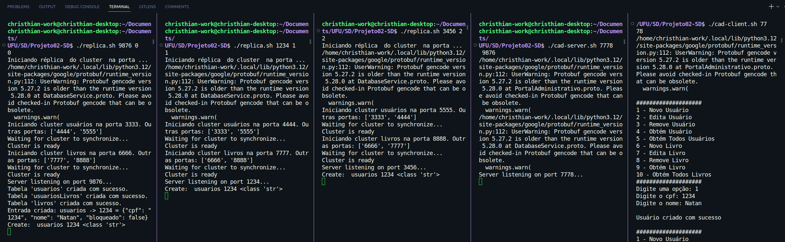

<h1>Projeto 2 de Sistemas Distribuídos</h1>

### Membros do Grupo

- Christhian Rezende Vieira           - 12111BCC028
- Chrystopher Pinter Oliveira Lacerda - 12111BCC027
- Eduardo Alvares Cipriano            - 12011BCC049
- Natan Gonçalves de Lyra             - 12111BCC006

### Requisitos Mínimos

- Arquivo README.md com instruções de compilação, inicialização e uso de clientes e servidores.

- Arquivo compile.sh para baixar/instalar dependências, compilar e gerar binários.

- Arquivo cad-server.sh para executar o servidor do Portal Cadastro, recebendo como parâmetro ao menos a porta em que o servidor deve aguardar conexões.

- Arquivo cad-client.sh para executar o cliente interativo do Portal Cadastro, recebendo como parâmetro ao menos a porta do servidor que deve se conectar.

- Arquivo bib-server.sh para executar o servidor do Portal Biblioteca, recebendo como parâmetro ao menos a porta em que o servidor deve aguardar conexões.

- Arquivo bib-client.sh para executar o cliente interativo do Portal Biblioteca, recebendo como parâmetro ao menos a porta do servidor que deve se conectar.

- Descrição das dificuldades com indicação do que não foi implementado.

- Arquivo replica.sh para executar cada réplica do serviço de persistência, recebendo como parâmetro o id da réplica (0, 1 ou 2) e o número do cluster a que ela pertence (0 ou 1).

## Mudanças na implementação 

### Execução de Réplicas

O script `replica.sh` é responsável por criar réplicas para dois clusters: o Cluster de Usuários e o Cluster de Livros. Abaixo, você encontrará as instruções para utilizá-lo.

### Parâmetros de Execução

O script deve ser executado com três parâmetros:

1. **Porta gRPC**: A porta que o serviço gRPC irá utilizar.
2. **ID da réplica do Cluster de Usuários**: Um número que identifica qual réplica do cluster de usuários será criada.
3. **ID da réplica do Cluster de Livros**: Um número que identifica qual réplica do cluster de livros será criada.

### Exemplos de Uso

A seguir está um exemplo de como utilizar o script para criar réplicas:

```bash
./replica.sh <porta_database_service> <id_replica_cluster_1> <id_replica_cluster_2>
```

Por exemplo, para criar a primeira réplica para ambos os clusters, você pode usar:

```bash
./replica.sh 1234 0 0
```

Essa execução criará:

- Uma réplica com `id` 0 no Cluster de Usuários, escutando na porta 3333.
- Uma réplica com `id` 0 no Cluster de Livros, escutando na porta 6666.

### Criação de Múltiplas Réplicas

Para criar três réplicas em cada cluster, você deve executar o script três vezes, variando os IDs:

```bash
./replica.sh 1234 0 0
./replica.sh 5678 1 1
./replica.sh 1579 2 2
```

Isso criará as seguintes réplicas:

- Cluster de Usuários:
    - ID 0: porta 3333
    - ID 1: porta 4444
    - ID 2: porta 5555
- Cluster de Livros:
    - ID 0: porta 6666
    - ID 1: porta 7777
    - ID 2: porta 8888

## Instruções de Compilação

Primeiramente faça o <I>git clone</I> do nosso repositório.

```bash
git clone https://github.com/christhian12rv/SD-Parte-2.git
```

Logo em seguida instale todas as depêndencias necessárias para a execução do projeto:

```bash
cd SD-PARTE-2
chmod +x compile.sh
./compile.sh
```

## Abertura dos Servidores e Clientes

Para cada Servidor Administrativo execute essa linha substituido <I><B><PORTA_DESEJADA></B></I> <I><B><PORTA_DATABASE_SERVICE></B></I>  com a porta para aquele servidor e a porta do serviço de banco de dados: 

```bash
./cad-server.sh <PORTA_DESEJADA> <PORTA_DATABASE_SERVICE>
```

Para cada Servidor Biblioteca execute essa linha substituido <I><B><PORTA_DESEJADA></B></I> <I><B><PORTA_DATABASE_SERVICE></B></I>  com a porta para aquele servidor e a porta do serviço de banco de dados:

```bash 
./bib-server.sh <PORTA_DESEJADA> <PORTA_DATABASE_SERVICE>
```

Para cada Cliente Administrativo execute essa linha substituido <I><B><PORTA_DESEJADA></B></I> com a porta igual a de um servidor previamente inicializado:

```bash
./cad-client.sh <PORTA_DESEJADA>
```

Para cada Cliente Biblioteca execute essa linha substituido <I><B><PORTA_DESEJADA></B></I> com a porta igual a de um servidor previamente inicializado:

```bash
./bib-client.sh <PORTA_DESEJADA>
```

## Utilização dos Clientes e Servidores

<B>Servidores</B>: Após executar as linhas de comando que inicializam os servidores, basta deixar o terminal aberto para que o servidor continue a funcionar.

<B>Clientes</B>: Após executar as linhas de comando que inicializam os clientes, basta selecionar uma operação apartir do menu impresso no terminal, onde a leitura será realizada a partir do teclado.

<B>Réplicas</B>: Após executar as linhas de comando que inicializam as réplicas, basta deixar os terminais abertos para que o serviço de banco de dados continue a funcionar.

## Exemplo de Execução

<b>OBS</b>: 
- Os três primeiros terminais são instâncias de réplicas de cada cluster. 
- O quarto terminal é uma instância de um servidor administrativo conectado a porta 9876 (primeiro terminal). 
- O quinto terminal é uma instância de cliente administrativo conectado a porta 7778 (quarto terminal). 
- O funcionamento do servidor e cliente de biblioteca são iguais. 


